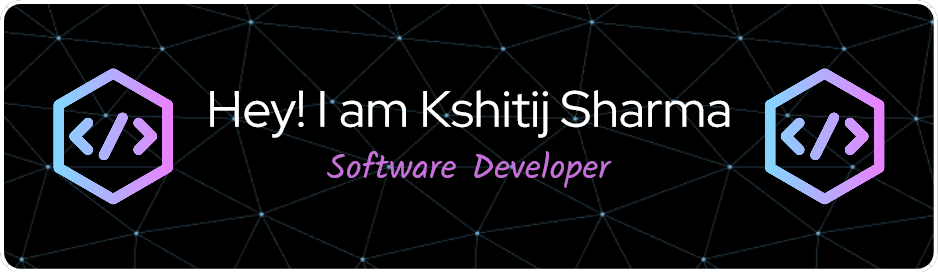

  

## 😄 About Me
- 🎓 I am a Bachelor of Technology, Computer Science graduate, from Dr. AKhilesh Das Gupta Institute of Technology and Management, IPU, Delhi, India.
- 🌱 I am currently learning Flutter and related technologies, and simultaneously looking for related work oppurtunities.
- 🔭 I am currently working on different personal projects and learning new stuff.
- 💬 If you have any question/feedback, please do not hesitate to reach out to me!

  
  

## 👨‍💻 My projects
* [Blood Buddy](https://github.com/KshitijSh-2604/BLOOD-BUDDY-FINAL-main) - Blood Buddy is an innovative <strong>Flutter-based mobile application</strong>, with <strong>Firebase</strong> as backend, designed to seamlessly bridge the gap between patients in need of blood and willing donors within a specific geographic area.
* [Expense Tracker App](https://github.com/KshitijSh-2604/Expense-Tracker-App) - An intuitive and efficient expense tracker app crafted with <strong>Flutter</strong> technology. This app simplifies the process of managing your finances by allowing user to effortlessly track their expenses on the go. It enables users to categorize expenditures and visualize spendings through insightful bar chart.
* [Hotel Management System](https://github.com/KshitijSh-2604/JavaCollegeProject) - Fully functional Hotel Management System, created using <strong>Java</strong>, <strong>SQL</strong> and <strong>Java AWT</strong> for my junior year college project.
* [Portfolio V1](https://github.com/KshitijSh-2604/Portfolio) - A Portfolio website made using <strong>HTML</strong> and <strong>CSS</strong>.

 

## 💼 Technical Skills

  

  

 

<!--
**KshitijSh-2604/KshitijSh-2604** is a ✨ _special_ ✨ repository because its `README.md` (this file) appears on your GitHub profile.
-->
